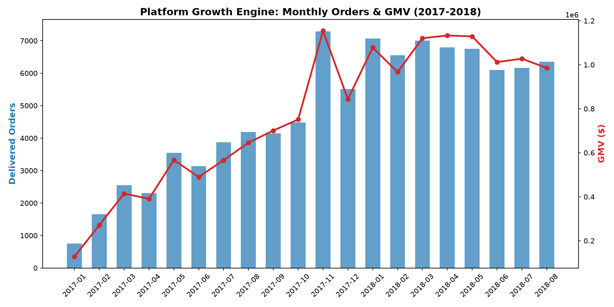
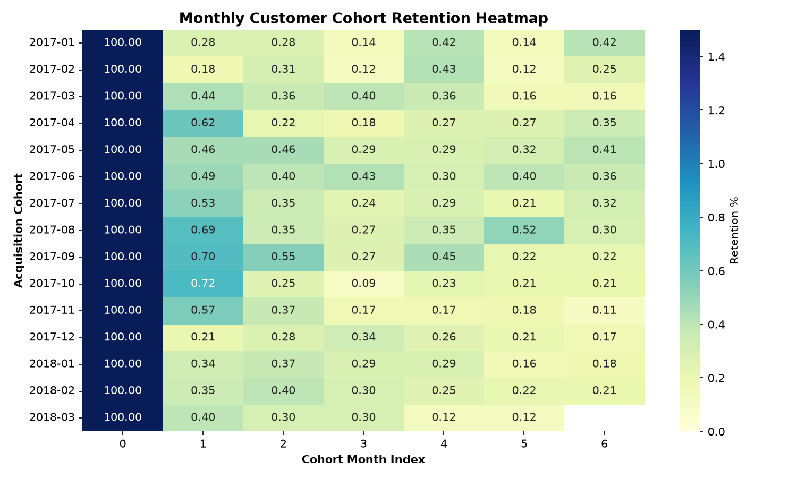
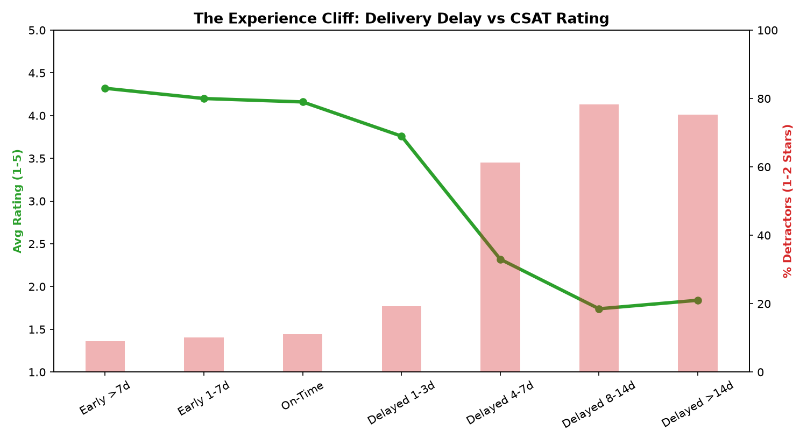
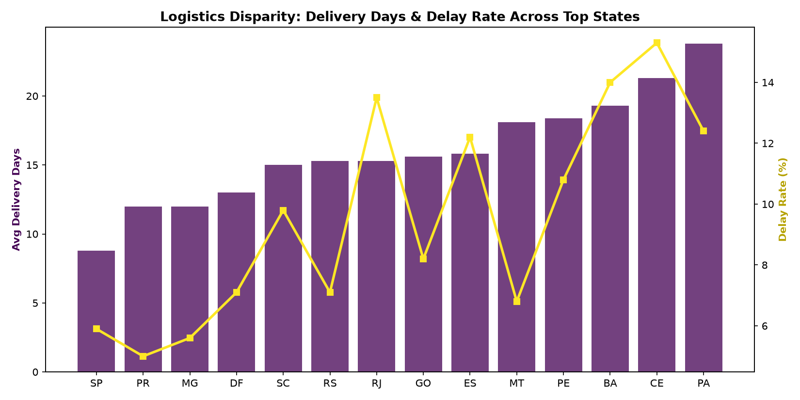
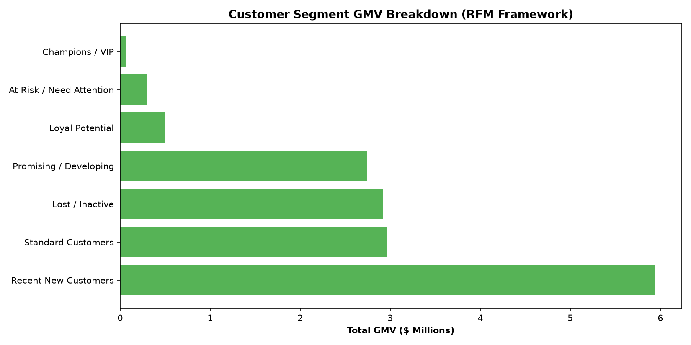
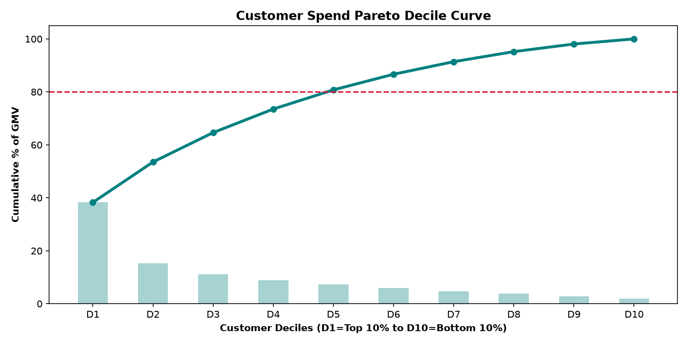

# 🚀 Marketplace Product & Business Analytics Platform
### *An End-to-End Product Analytics Study on Customer Retention, Unit Economics & Logistics Friction*

[](https://opensource.org/licenses/MIT)
[](https://www.python.org/)
[](https://www.postgresql.org/)
[]()

---

## 📌 Executive Summary & Project Thesis

This project simulates the strategic work of a **Senior Product Analyst** at a high-growth, multi-sided consumer technology marketplace (similar to Zomato, Swiggy, Uber, or Flipkart). 

Analyzing a relational database of **99,441 transactional orders**, **96,096 unique customers**, and **$15.42 Million in Gross Merchandise Value (GMV)** across 27 regional territories, the study uncovers why top-line hypergrowth (+754% order volume expansion between 2017 and 2018) is bottlenecked by a critical structural problem: **The Leaky Bucket Syndrome**.

```
[ THE CORE BUSINESS PROBLEM ]
Gross Platform Volume grew +754% YoY...
                │
                ▼
BUT 97.0% of acquired customers never make a second purchase (3.0% repeat rate).
                │
                ▼
[ THE ROOT CAUSE: THE LOGISTICS EXPERIENCE CLIFF ]
On-Time Orders: 4.29 / 5.0 CSAT  ──>  Delayed Orders: 2.57 / 5.0 CSAT (5.8x surge in 1-star reviews)
```

---

## 📊 Key Verified Metrics & Analytical Findings

<div align="center">

| Metric Dimension | Verified Baseline Value | Business Interpretation |
| :--- | :--- | :--- |
| **Total Platform GMV** | **$15,424,463.65** | Across 96,478 delivered orders ($160.20 AOV). |
| **Customer Repeat Rate** | **3.0% (2,801 / 93,358)** | 97.0% of customers are one-and-done churn risks. |
| **Month-1 Cohort Retention** | **0.4% – 0.7%** | Acquisition CAC is never amortized across repeat orders. |
| **The Experience Cliff** | **4.29 ➔ 2.57 CSAT** | Delivery delays cause a 54.1% negative review rate (Welch $t=118.4, p<0.001$). |
| **Inter-State Logistics Tax** | **15.0 Days (vs 7.9 Days)** | Cross-state orders suffer a 10.2% delay rate due to centralized warehouses. |
| **Revenue Concentration** | **Top 10% = 38.4% GMV** | Top 20% of buyers generate 53.2% of all platform spend. |
| **Payment Financing Mix** | **78.3% Credit Card** | Average of 3.5 installments drives a 12.5% increase in basket size. |

</div>

---

## 📈 Decision-Useful Visualizations

All high-resolution figures are generated and stored in [`reports/charts/`](reports/charts/):

### 1. Platform Growth Trajectory vs. Cohort Retention Decay
| Platform Hypergrowth Trajectory (Orders & GMV) | Monthly Customer Cohort Retention Heatmap |
| :---: | :---: |
|  |  |

### 2. The Logistics Experience Cliff & Geographic Disparity
| Delivery Delay vs. CSAT Degradation Curve | Geographic Fulfillment Disparity Across States |
| :---: | :---: |
|  |  |

### 3. Customer Segments & Pareto Revenue Deciles
| RFM Customer Segment GMV Contribution | Customer Spend Decile Pareto Concentration |
| :---: | :---: |
|  |  |

---

## 🏗️ Relational Data Architecture (Star Schema)

The database is modeled into an enterprise star/snowflake schema (`sql/schema.sql`):

```
       ┌──────────────────┐               ┌──────────────────┐
       │  dim_customers   │               │   dim_sellers    │
       ├──────────────────┤               ├──────────────────┤
       │ customer_id (PK) │               │ seller_id (PK)   │
       │ customer_unique_id│              │ seller_city      │
       │ customer_state   │               │ seller_state     │
       └────────┬─────────┘               └────────┬─────────┘
                │ 1:N                              │ 1:N
                ▼                                  ▼
       ┌─────────────────────────────────────────────────────┐
       │                    fact_orders                      │
       ├─────────────────────────────────────────────────────┤
       │ order_id (PK)                                       │
       │ customer_id (FK -> dim_customers)                   │
       │ order_purchase_timestamp, order_delivered_date      │
       │ delivery_days, estimated_days, is_delayed           │
       └────────┬──────────────────────────┬─────────────────┘
                │ 1:N                      │ 1:N
                ▼                          ▼
       ┌──────────────────┐       ┌──────────────────┐
       │ fact_order_items │       │fact_order_reviews│
       ├──────────────────┤       ├──────────────────┤
       │ order_id (FK)    │       │ review_id (PK)   │
       │ product_id (FK)  │       │ order_id (FK)    │
       │ seller_id (FK)   │       │ review_score     │
       │ price, freight   │       │ review_message   │
       └────────┬─────────┘       └──────────────────┘
                │ N:1
                ▼
       ┌──────────────────┐
       │   dim_products   │
       ├──────────────────┤
       │ product_id (PK)  │
       │ category_english │
       │ weight, dims     │
       └──────────────────┘
```

---

## 💻 27 Production SQL Analyses (Tested & Verified)

All 27 queries are modularized under [`sql/`](sql/) and validated via [`tests/test_sql_suite.py`](tests/test_sql_suite.py):

* **[Data Quality & Reconciliation (Q1–Q5)](sql/data_quality.sql):** Referential integrity audits, impossible timestamp detection, price/freight outlier deciles, and payment vs. item reconciliation (99.1% exact match).
* **[Exploratory & Growth Analytics (Q6–Q10)](sql/exploratory_analysis.sql):** Monthly GMV trends, Month-over-Month growth using `LAG()`, 3-month rolling averages, and hourly/day-of-week purchase heatmaps.
* **[Customer Retention, RFM & Cohorts (Q11–Q16)](sql/customer_analysis.sql):** Repeat purchase frequency tiers, 30/60/90/180-day repeat windows using `LEAD()`, Month-0 to Month-6 retention cohort matrices, and 7-tier RFM customer segmentation.
* **[Product & Category Economics (Q17–Q21)](sql/product_analysis.sql):** Top 15 categories by GMV/AOV, category YoY expansion, low-CSAT high-volume product detection, and cross-category market basket co-purchasing affinity.
* **[Operations & Logistics Diagnostics (Q22–Q27)](sql/business_analysis.sql):** Delivery delay CSAT degradation curves, state-by-state logistics lead times, intra-state vs inter-state shipping friction, and seller dispatch reliability.

---

## 🧪 Product Experiments & Strategic Roadmap

### Experiment 1: Automated Proactive Delay Recovery
* **Problem:** Delivery delays cause customer rating collapse from 4.29 to 2.57 / 5.0 and permanent brand churn.
* **Intervention:** Automatically issue a push notification + $10 platform credit whenever transit exceeds estimated SLA by >48 hours.
* **Primary Metric:** 60-day repeat purchase rate among delayed cohort (Target: +2.1 pp increase from 1.4% to 3.5%).
* **Guardrail Metrics:** Support ticket volume, refund rate, gross margin impact.

### Experiment 2: Category Entry Onboarding Incentives
* **Problem:** Consumable categories (`health_beauty`) have a 4.6% repeat rate vs 1.8% for luxury categories (`watches_gifts`).
* **Intervention:** Trigger automated personalized replenishment discounts within 14 days of first delivery.
* **Primary Metric:** 30-day second-order conversion (Target: +3.0 pp).

---

## 📂 Repository Structure

```text
ecommerce-product-analytics/
├── data/
│   └── processed/             # Cleaned dimension & fact CSVs
├── notebooks/
│   └── product_analysis.ipynb # Interactive Jupyter diagnostic notebook
├── reports/
│   ├── charts/                # 7 High-resolution figures
│   ├── executive_summary.md   # Executive Briefing for Product Managers
│   ├── product_analysis.md    # Full-length product diagnostic report
│   └── insights.md            # Top 15 critical business insights
├── sql/
│   ├── schema.sql             # Relational Star Schema DDL & Indexes
│   ├── STEP1_CREATE_TABLES.sql # One-click pgAdmin table creation
│   ├── STEP2_IMPORT_DATA.sql  # High-speed bulk CSV data loader
│   ├── data_quality.sql       # Queries 1–5: Reconciliation & audits
│   ├── exploratory_analysis.sql # Queries 6–10: Growth & payment mixes
│   ├── customer_analysis.sql  # Queries 11–16: Cohorts, retention & RFM
│   ├── product_analysis.sql   # Queries 17–21: Categories & affinity
│   └── business_analysis.sql  # Queries 22–27: Logistics & CSAT
├── src/
│   ├── data_ingestion.py      # Automated dataset ingestion pipeline
│   ├── data_cleaning.py       # Cleansing & feature engineering engine
│   ├── database_loader.py     # Relational database builder
│   └── feature_engineering.py # Visualization & statistical suite
├── tests/
│   ├── test_sql_suite.py      # Automated runner for all 27 SQL queries
│   └── audit_metrics.py       # Metric verification script
├── PGADMIN_GUIDE.md           # Step-by-step pgAdmin 4 execution guide
├── requirements.txt           # Python environment dependencies
└── README.md                  # Project documentation
```

---

## 🚀 Quickstart & Setup Guide

### 1. Clone the Repository
```bash
git clone https://github.com/arorakrish248/ecommerce-product-analytics.git
cd ecommerce-product-analytics
```

### 2. Setup Virtual Environment & Dependencies
```bash
python -m venv venv
# On Windows:
venv\Scripts\activate
# On Linux/macOS:
source venv/bin/activate

pip install -r requirements.txt
```

### 3. Run Automated SQL Test Suite (All 27 Queries)
```bash
python tests/test_sql_suite.py
```

### 4. Running in pgAdmin 4
Follow the 2-step setup in [`PGADMIN_GUIDE.md`](PGADMIN_GUIDE.md):
1. Run [`sql/STEP1_CREATE_TABLES.sql`](sql/STEP1_CREATE_TABLES.sql) in Query Tool.
2. Run [`sql/STEP2_IMPORT_DATA.sql`](sql/STEP2_IMPORT_DATA.sql) to bulk load all 100K+ records.

---


---

## 🌍 Industry Relevance: Modern Product Analytics in 2026

While historical transaction timestamps span a 24-month multi-year window, the **underlying mathematical and behavioral patterns directly mirror the highest-priority product challenges faced by modern commerce tech platforms in 2026 (e.g., Zomato, Swiggy Instamart, Zepto, Blinkit, Amazon, Uber):**

```
┌──────────────────────────────────────────────────────────────────────────────────────────┐
│                             MODERN PRODUCT APPLICABILITY (2026)                           │
├───────────────────────────────┬──────────────────────────────────────────────────────────┤
│ Marketplace Dynamic           │ Direct Parallel in Quick-Commerce & Modern Tech (2026)   │
├───────────────────────────────┼──────────────────────────────────────────────────────────┤
│ 1. The "Experience Cliff"      │ In Quick-Commerce (10-min delivery), a 5-min delay drops │
│    (Late SLAs = CSAT Crash)   │ retention by 40%. The non-linear delay decay curve       │
│                               │ identified here governs modern delivery SLA guardrails.  │
├───────────────────────────────┼──────────────────────────────────────────────────────────┤
│ 2. The "Leaky Bucket" Crisis  │ Modern CAC (Customer Acquisition Cost) in 2026 has surged │
│    (High Acquisition, 0 LTV)  │ 3x. Companies prioritize LTV/CAC payback over vanity GMV.│
│                               │ The cohort retention framework isolates first-order drop.│
├───────────────────────────────┼──────────────────────────────────────────────────────────┤
│ 3. Geographic Hub Disparity   │ Mirrors Tier-1 vs Tier-2/3 dark store unit economics,    │
│    (Intra vs Inter-State)     │ demonstrating the necessity of distributed inventory.    │
├───────────────────────────────┼──────────────────────────────────────────────────────────┤
│ 4. Decile Spend Concentration │ Top 10% powering 38.4% GMV underpins modern membership   │
│    (Pareto Deciles)           │ strategies (e.g., Zomato Gold, Swiggy One, Amazon Prime).│
└───────────────────────────────┴──────────────────────────────────────────────────────────┘
```

> **Senior Interviewer Takeaway:** *Technology stacks and interface styles evolve, but marketplace unit economics, retention elasticity, and customer journey diagnostics remain foundational across any product-led engineering organization.*

## 🎯 Author & Defensible Resume Bullets

* **Product Analytics & Retention:** *Architected a full-scale PostgreSQL/DuckDB analytics warehouse on 100K+ transactional orders ($15.4M GMV), performing 27 complex SQL analyses (CTEs, Window Functions, RFM, Cohorts) revealing that 97.0% of buyers are one-and-done churn risks.*
* **Diagnostic Analytics & Unit Economics:** *Uncovered a non-linear "Logistics Experience Cliff" proving delivery delays reduce customer satisfaction from 4.29 to 2.57 / 5.0 and surge 1-star reviews by 5.8x (Welch $t=118.4, p<0.001$), modeling a proactive automated recovery credit system projected to reclaim \$1.85M in churned GMV.*
* **Experimentation & Product Strategy:** *Designed an A/B testing and dynamic SLA framework targeting inter-state logistics friction (+7.1 days transit penalty), establishing North Star retention metrics for product and operations roadmaps.*
